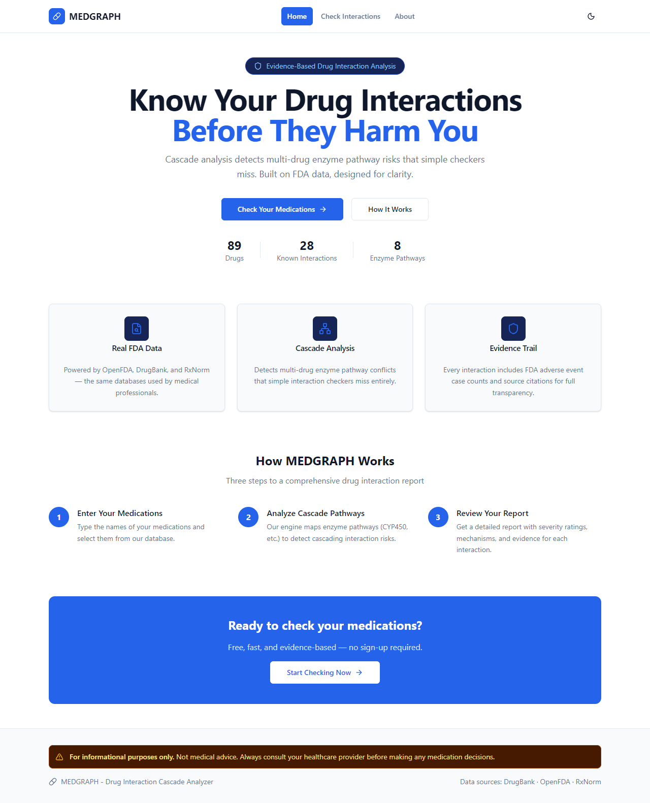
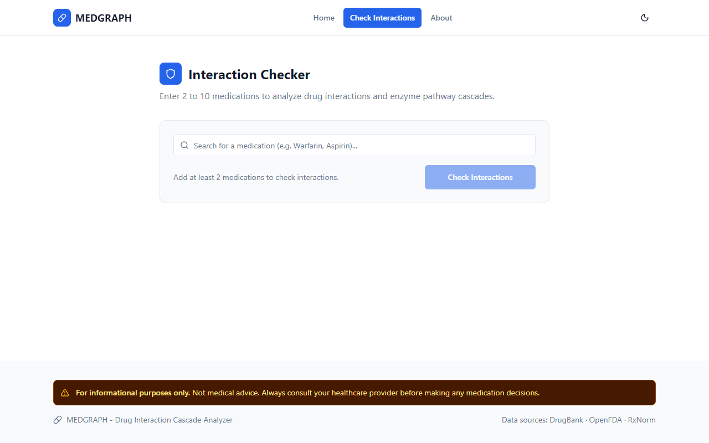
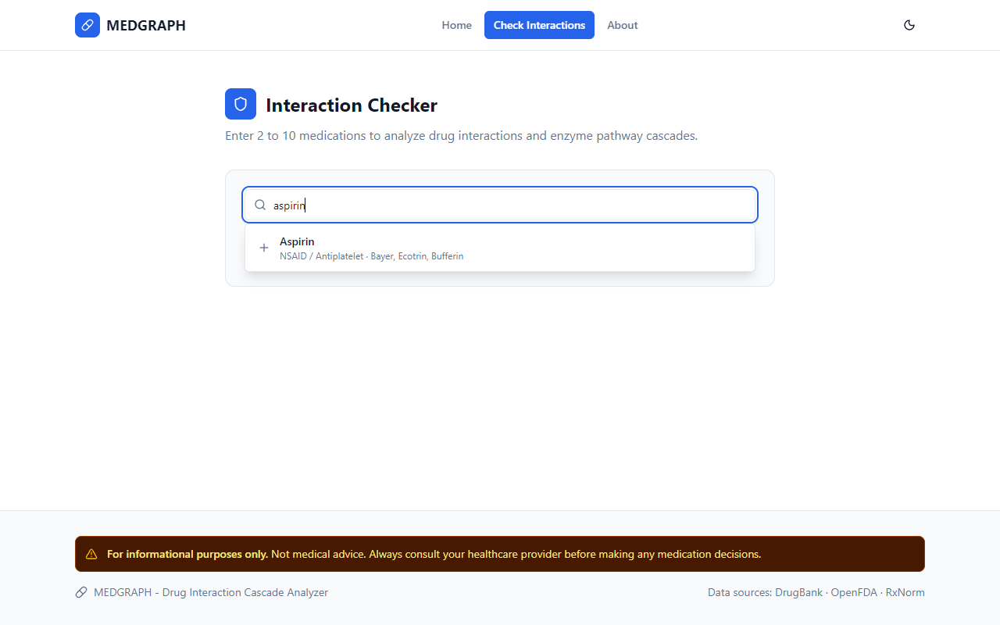
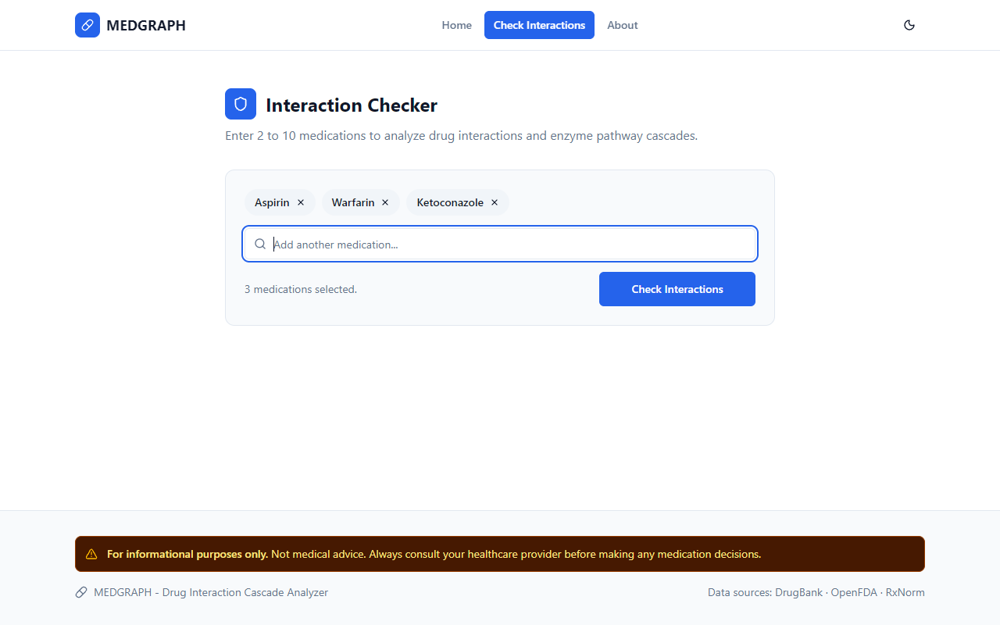
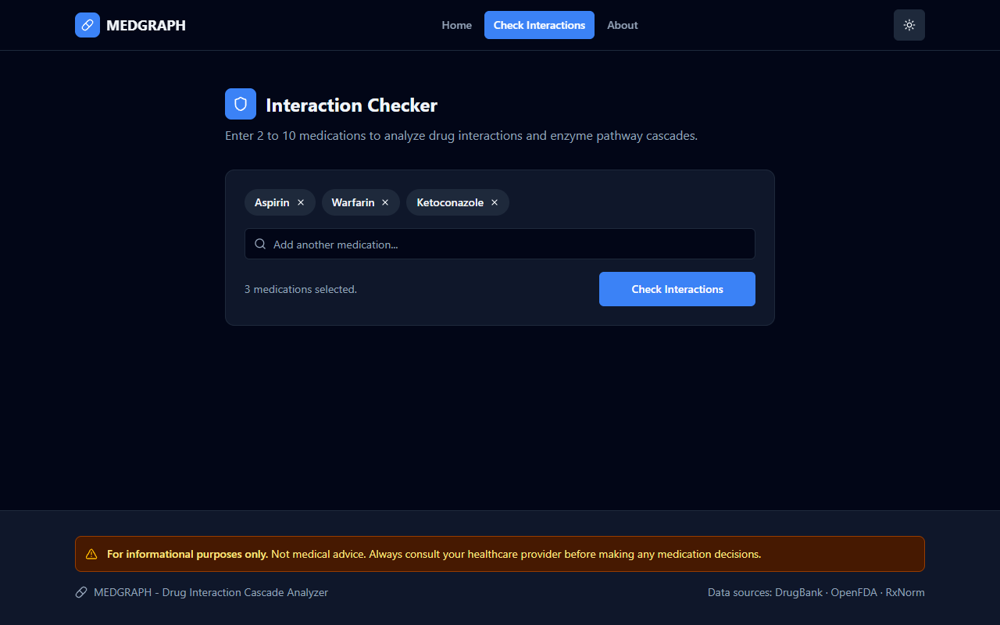

```
 __  __ _____ ____   ____ ____      _    ____  _   _
|  \/  | ____|  _ \ / ___|  _ \    / \  |  _ \| | | |
| |\/| |  _| | | | | |  _| |_) |  / _ \ | |_) | |_| |
| |  | | |___| |_| | |_| |  _ <  / ___ \|  __/|  _  |
|_|  |_|_____|____/ \____|_| \_\/_/   \_\_|   |_| |_|
```

# MEDGRAPH — Drug Interaction Cascade Analyzer

[](https://www.python.org/)
[](LICENSE)
[]()

> **MEDGRAPH** detects dangerous multi-drug interaction *cascades* — not just direct pairwise conflicts — using a knowledge graph built on real FDA/pharmacological data.

---

## What is MEDGRAPH?

Most drug checkers ask: *"Do Drug A and Drug B interact?"*

MEDGRAPH asks: *"What happens when Ketoconazole inhibits the enzyme that metabolises Simvastatin, causing it to accumulate to toxic levels?"*

The difference is **cascade analysis**. MEDGRAPH models each drug's relationship to metabolic enzymes (CYP450 pathways), then traces multi-hop interaction chains across the full drug list. A cascade can involve drugs that have **no direct interaction** but still cause serious harm through shared enzyme pathways.

---

## Key Features

- **Cascade Detection** — traces CYP450 enzyme pathway chains, not just pairwise lookups
- **Evidence Trail** — every interaction is backed by FDA FAERS adverse event counts and DrugBank citations
- **Real Pharmacological Data** — seeded from DrugBank open subset, OpenFDA FAERS, and RxNorm
- **CYP450 Enzyme Pathways** — 8 enzymes modelled (CYP3A4, CYP2D6, CYP2C9, CYP2C19, CYP1A2, and more)
- **Risk Scoring** — four severity tiers: minor / moderate / major / critical
- **React Frontend** — autocomplete drug search, cascade path visualisation, light/dark theme
- **REST API** — 6 endpoints, OpenAPI docs at `/docs`

---

## Screenshots

| Home | Drug Checker | Autocomplete |
|------|-------------|-------------|
|  |  |  |

| Drugs Selected | Results | Dark Mode |
|---------------|---------|-----------|
|  |  |  |

---

## Quick Start

### Prerequisites

- Python 3.11+
- Node 20+

### Install

```bash
# Clone and install backend
git clone <repo-url> medgraph
cd medgraph
pip install -e ".[dev]"

# Install frontend dependencies
cd dashboard
npm install
cd ..
```

### Seed the database

```bash
python -m medgraph.cli seed
```

This loads 89 drugs, 28 interactions, and 8 CYP450 enzymes from built-in data. Pass `--openfda` to also fetch live FDA adverse event counts (requires internet).

### Serve the API

```bash
python -m medgraph.cli serve
# API available at http://localhost:8000
# Interactive docs at http://localhost:8000/docs
```

### Run the frontend dev server

```bash
cd dashboard
npm run dev
# Frontend at http://localhost:5173
```

Or use Make:

```bash
make install   # install all dependencies
make seed      # seed the database
make serve     # start API server
make dev       # start frontend dev server
```

---

## How It Works

**Step 1 — Build the Knowledge Graph**

Each drug node is connected to enzyme nodes via typed edges: `inhibits`, `induces`, or `substrate`. The graph is built from DrugBank data and stored in SQLite via NetworkX.

**Step 2 — Cascade Analysis**

For a given drug list, MEDGRAPH:
1. Checks all pairwise combinations for direct interactions
2. Finds shared CYP450 enzymes and traces inhibition/induction chains
3. Scores each interaction pair with a 0–100 risk score
4. Aggregates to an overall risk tier

**Step 3 — Example**

```
Ketoconazole  →  inhibits  →  CYP3A4  →  is substrate of  →  Simvastatin
```

Ketoconazole strongly inhibits CYP3A4. Simvastatin depends on CYP3A4 for metabolism. Combined, Simvastatin plasma levels rise 10–20x, causing rhabdomyolysis. MEDGRAPH flags this as **critical** and traces the exact enzyme path.

---

## API Documentation

The API runs at `http://localhost:8000`. Interactive Swagger UI at `/docs`.

| Method | Endpoint | Description |
|--------|----------|-------------|
| `POST` | `/api/check` | Analyze drug list for interactions and cascades |
| `GET` | `/api/drugs/search` | Autocomplete drug search (`?q=asp&limit=10`) |
| `GET` | `/api/drugs/{drug_id}` | Full drug profile with enzyme relations |
| `GET` | `/api/stats` | Database statistics (drug/interaction/enzyme counts) |
| `GET` | `/health` | API health check with graph node count |
| `GET` | `/docs` | OpenAPI Swagger UI |

### Example request

```bash
curl -X POST http://localhost:8000/api/check \
  -H "Content-Type: application/json" \
  -d '{"drugs": ["Ketoconazole", "Simvastatin", "Warfarin"]}'
```

---

## Tech Stack

| Layer | Technology |
|-------|-----------|
| Backend | Python 3.11, FastAPI, Uvicorn |
| Graph engine | NetworkX 3.x |
| Storage | SQLite (via Python stdlib) |
| Frontend | React 19, TypeScript, Tailwind CSS v4, Vite |
| Data pipeline | httpx (async), OpenFDA API, RxNorm API |
| Testing | pytest 8, FastAPI TestClient |
| Linting | ruff |

---

## Data Sources

- **[DrugBank Open Subset](https://go.drugbank.com/releases/latest#open-data)** — drug profiles, enzyme relations, interaction records
- **[OpenFDA FAERS](https://open.fda.gov/apis/drug/event/)** — real-world adverse event reports (evidence counts)
- **[RxNorm API](https://rxnav.nlm.nih.gov/RxNormAPIs.html)** — drug name normalisation and brand-name resolution

---

## Medical Disclaimer

> **THIS SOFTWARE IS FOR INFORMATIONAL AND EDUCATIONAL PURPOSES ONLY.**
>
> **MEDGRAPH IS NOT A MEDICAL DEVICE AND DOES NOT PROVIDE MEDICAL ADVICE.**
> The information presented does not replace the clinical judgment of a qualified healthcare professional. Drug interaction severity depends on individual patient factors including genetics, dosage, comorbidities, and other medications.
>
> **ALWAYS consult a licensed pharmacist or physician before making any medication decisions.**
>
> The authors and contributors accept no liability for clinical decisions made based on this software.

---

## Contributing

Contributions are welcome. Please read [CONTRIBUTING.md](CONTRIBUTING.md) for development setup, code standards, and the PR process.

## License

[MIT](LICENSE) — Copyright 2026 MEDGRAPH Contributors
